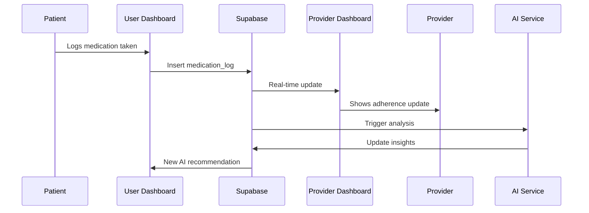
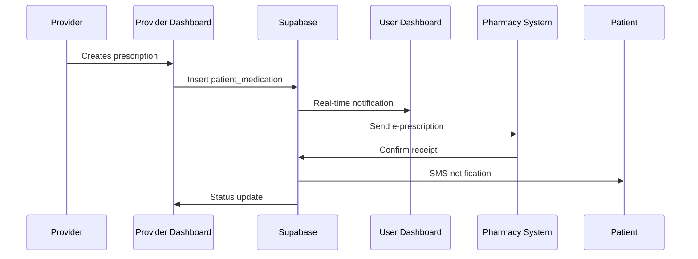
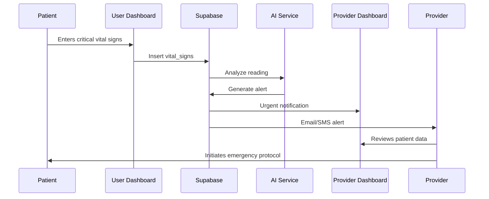

# Dual Healthcare Dashboard Architecture Plan
## Medicare+ Advanced Healthcare Ecosystem

### 🏗️ **System Overview**

This document outlines the architecture for a comprehensive dual-dashboard healthcare system connecting patients with healthcare providers through real-time data synchronization, AI-powered insights, and seamless communication channels.

---

## 📋 **Table of Contents**

1. [System Architecture](#system-architecture)
2. [Dashboard Specifications](#dashboard-specifications)
3. [Database Design](#database-design)
4. [Real-Time Data Flow](#real-time-data-flow)
5. [User Roles & Permissions](#user-roles--permissions)
6. [Feature Matrix](#feature-matrix)
7. [API Architecture](#api-architecture)
8. [Security Framework](#security-framework)
9. [Technical Implementation](#technical-implementation)
10. [Integration Points](#integration-points)
11. [Development Roadmap](#development-roadmap)

---

## 🏗️ **System Architecture**

### **High-Level Architecture**
```
┌─────────────────┐    ┌─────────────────┐    ┌─────────────────┐
│   User Dashboard│    │  Shared Backend │    │Provider Dashboard│
│   (Patient)     │◄──►│   (Supabase)    │◄──►│ (Hospital/Clinic)│
│                 │    │                 │    │                 │
└─────────────────┘    └─────────────────┘    └─────────────────┘
         │                       │                       │
         │              ┌─────────────────┐              │
         └──────────────►│  Real-Time Sync │◄─────────────┘
                        │   (WebSockets)  │
                        └─────────────────┘
```

### **Core Components**
- **Frontend**: React 18 with TypeScript
- **Backend**: Supabase (PostgreSQL + Real-time)
- **Authentication**: Supabase Auth with JWT
- **Real-time**: Supabase Realtime subscriptions
- **Storage**: Supabase Storage for files/images
- **AI/ML**: Integrated AI services for health insights

---

## 📱 **Dashboard Specifications**

### **1. User Dashboard (Patient Portal)**

#### **Primary Features**
- **Personal Health Overview**
  - Health score visualization
  - Current medication status
  - Upcoming appointments
  - Recent vital signs

- **Medication Management**
  - Interactive medication calendar
  - Adherence tracking with real-time updates
  - Side effect reporting
  - Refill notifications

- **Appointment System**
  - View scheduled appointments
  - Reschedule/cancel functionality
  - Telehealth integration
  - Appointment reminders

- **Health Analytics**
  - Personal health trends
  - Medication effectiveness charts
  - Vital signs progression
  - AI-powered health insights

- **Communication**
  - Secure messaging with providers
  - Appointment notes access
  - Lab results viewing
  - Educational content delivery

#### **Advanced Features**
- **AI Health Advisor**
  - Personalized recommendations
  - Risk assessment algorithms
  - Lifestyle optimization suggestions
  - Predictive health insights

- **Smart Reminders**
  - Medication timing optimization
  - Health screening alerts
  - Appointment preparation checklists
  - Lifestyle goal tracking

### **2. Provider Dashboard (Hospital/Clinic Portal)**

#### **Primary Features**
- **Patient Management**
  - Patient roster with real-time status
  - Individual patient profiles
  - Health history timeline
  - Current medication reviews

- **Clinical Overview**
  - Department-wide patient status
  - Critical alerts and notifications
  - Appointment schedule management
  - Resource allocation tracking

- **Medication Oversight**
  - Patient adherence monitoring
  - Prescription management
  - Drug interaction alerts
  - Medication effectiveness tracking

- **Analytics & Reports**
  - Population health metrics
  - Treatment outcome analysis
  - Resource utilization reports
  - Quality measure tracking

- **Communication Hub**
  - Patient messaging system
  - Inter-provider collaboration
  - Care team coordination
  - Emergency notification system

#### **Advanced Features**
- **AI Clinical Insights**
  - Patient risk stratification
  - Treatment recommendation engine
  - Outcome prediction models
  - Care gap identification

- **Care Coordination**
  - Multi-provider case management
  - Referral tracking system
  - Care plan collaboration
  - Quality improvement workflows

---

## 🗄️ **Database Design**

### **Core Entities Structure**

```sql
-- Enhanced User Management
users (
  id: uuid PRIMARY KEY,
  email: text UNIQUE,
  role: user_role_enum ('patient', 'provider', 'admin', 'staff'),
  created_at: timestamp,
  updated_at: timestamp,
  last_login: timestamp,
  status: account_status_enum ('active', 'suspended', 'pending')
);

-- Detailed User Profiles
user_profiles (
  id: uuid PRIMARY KEY REFERENCES users(id),
  first_name: text,
  last_name: text,
  date_of_birth: date,
  gender: gender_enum,
  phone: text,
  address: jsonb,
  emergency_contact: jsonb,
  insurance_info: jsonb,
  medical_history: jsonb,
  allergies: text[],
  preferred_language: text,
  profile_image_url: text
);

-- Healthcare Organizations
organizations (
  id: uuid PRIMARY KEY,
  name: text NOT NULL,
  type: org_type_enum ('hospital', 'clinic', 'pharmacy', 'lab'),
  address: jsonb,
  contact_info: jsonb,
  certifications: jsonb,
  specialties: text[],
  status: org_status_enum ('active', 'inactive'),
  created_at: timestamp
);

-- Provider Profiles
provider_profiles (
  id: uuid PRIMARY KEY REFERENCES users(id),
  organization_id: uuid REFERENCES organizations(id),
  license_number: text,
  specialties: text[],
  qualifications: jsonb,
  department: text,
  role: provider_role_enum ('doctor', 'nurse', 'pharmacist', 'admin'),
  is_primary_care: boolean DEFAULT false,
  consultation_fee: decimal,
  availability_schedule: jsonb
);

-- Patient-Provider Relationships
patient_provider_relationships (
  id: uuid PRIMARY KEY,
  patient_id: uuid REFERENCES users(id),
  provider_id: uuid REFERENCES users(id),
  organization_id: uuid REFERENCES organizations(id),
  relationship_type: relationship_type_enum ('primary_care', 'specialist', 'consulting'),
  start_date: date,
  end_date: date,
  status: relationship_status_enum ('active', 'inactive', 'pending'),
  notes: text
);

-- Enhanced Medications
medications (
  id: uuid PRIMARY KEY,
  name: text NOT NULL,
  generic_name: text,
  brand_names: text[],
  drug_class: text,
  dosage_forms: text[],
  strength_options: text[],
  manufacturer: text,
  ndc_code: text,
  description: text,
  side_effects: text[],
  contraindications: text[],
  interactions: text[]
);

-- Patient Medications with Rich Data
patient_medications (
  id: uuid PRIMARY KEY,
  patient_id: uuid REFERENCES users(id),
  medication_id: uuid REFERENCES medications(id),
  prescribed_by: uuid REFERENCES users(id),
  organization_id: uuid REFERENCES organizations(id),
  dosage: text,
  frequency: text,
  route: medication_route_enum,
  start_date: date,
  end_date: date,
  quantity_prescribed: integer,
  refills_remaining: integer,
  pharmacy_id: uuid REFERENCES organizations(id),
  prescription_number: text,
  status: medication_status_enum ('active', 'discontinued', 'completed', 'on_hold'),
  notes: text,
  created_at: timestamp,
  updated_at: timestamp
);

-- Medication Adherence Tracking
medication_logs (
  id: uuid PRIMARY KEY,
  patient_medication_id: uuid REFERENCES patient_medications(id),
  patient_id: uuid REFERENCES users(id),
  scheduled_time: timestamp,
  actual_time: timestamp,
  status: adherence_status_enum ('taken', 'missed', 'delayed', 'partial'),
  method: log_method_enum ('manual', 'reminder', 'provider_confirmed'),
  notes: text,
  side_effects_reported: text[],
  effectiveness_rating: integer CHECK (effectiveness_rating >= 1 AND effectiveness_rating <= 10),
  created_at: timestamp
);

-- Comprehensive Appointments
appointments (
  id: uuid PRIMARY KEY,
  patient_id: uuid REFERENCES users(id),
  provider_id: uuid REFERENCES users(id),
  organization_id: uuid REFERENCES organizations(id),
  appointment_type: appointment_type_enum ('consultation', 'follow_up', 'procedure', 'screening', 'telehealth'),
  status: appointment_status_enum ('scheduled', 'confirmed', 'in_progress', 'completed', 'cancelled', 'no_show'),
  scheduled_date: timestamp,
  duration_minutes: integer,
  location: text,
  telehealth_link: text,
  reason: text,
  notes: text,
  preparation_instructions: text,
  follow_up_required: boolean,
  priority: priority_enum ('low', 'medium', 'high', 'urgent'),
  created_at: timestamp,
  updated_at: timestamp
);

-- Detailed Health Records
health_records (
  id: uuid PRIMARY KEY,
  patient_id: uuid REFERENCES users(id),
  provider_id: uuid REFERENCES users(id),
  appointment_id: uuid REFERENCES appointments(id),
  record_type: record_type_enum ('consultation', 'diagnosis', 'treatment', 'lab_result', 'imaging'),
  title: text,
  description: text,
  findings: jsonb,
  diagnoses: text[],
  treatments: text[],
  recommendations: text[],
  attachments: jsonb,
  is_critical: boolean DEFAULT false,
  created_at: timestamp
);

-- Vital Signs Tracking
vital_signs (
  id: uuid PRIMARY KEY,
  patient_id: uuid REFERENCES users(id),
  recorded_by: uuid REFERENCES users(id),
  recorded_at: timestamp,
  blood_pressure_systolic: integer,
  blood_pressure_diastolic: integer,
  heart_rate: integer,
  temperature: decimal,
  weight: decimal,
  height: decimal,
  oxygen_saturation: integer,
  blood_glucose: decimal,
  notes: text,
  source: vital_source_enum ('manual', 'device', 'provider_exam')
);

-- AI Insights and Recommendations
ai_insights (
  id: uuid PRIMARY KEY,
  patient_id: uuid REFERENCES users(id),
  insight_type: insight_type_enum ('medication_optimization', 'risk_assessment', 'lifestyle_recommendation', 'care_gap'),
  title: text,
  description: text,
  recommendation: text,
  confidence_score: decimal CHECK (confidence_score >= 0 AND confidence_score <= 1),
  supporting_data: jsonb,
  status: insight_status_enum ('new', 'reviewed', 'accepted', 'dismissed'),
  created_at: timestamp,
  expires_at: timestamp
);

-- Communication System
messages (
  id: uuid PRIMARY KEY,
  sender_id: uuid REFERENCES users(id),
  recipient_id: uuid REFERENCES users(id),
  thread_id: uuid,
  subject: text,
  content: text,
  message_type: message_type_enum ('text', 'voice', 'image', 'document'),
  priority: priority_enum ('low', 'medium', 'high', 'urgent'),
  status: message_status_enum ('sent', 'delivered', 'read', 'archived'),
  attachments: jsonb,
  is_encrypted: boolean DEFAULT true,
  created_at: timestamp,
  read_at: timestamp
);

-- Notification System
notifications (
  id: uuid PRIMARY KEY,
  user_id: uuid REFERENCES users(id),
  type: notification_type_enum ('medication_reminder', 'appointment_reminder', 'message', 'alert', 'system'),
  title: text,
  content: text,
  action_url: text,
  priority: priority_enum ('low', 'medium', 'high', 'urgent'),
  status: notification_status_enum ('pending', 'sent', 'read', 'dismissed'),
  delivery_method: delivery_method_enum ('in_app', 'email', 'sms', 'push'),
  scheduled_for: timestamp,
  sent_at: timestamp,
  read_at: timestamp,
  created_at: timestamp
);

-- Analytics and Metrics
health_metrics (
  id: uuid PRIMARY KEY,
  patient_id: uuid REFERENCES users(id),
  metric_type: metric_type_enum ('adherence_rate', 'health_score', 'risk_score', 'quality_score'),
  value: decimal,
  unit: text,
  calculation_date: date,
  calculation_method: text,
  contributing_factors: jsonb,
  trend_direction: trend_enum ('improving', 'stable', 'declining'),
  created_at: timestamp
);

-- Care Plans
care_plans (
  id: uuid PRIMARY KEY,
  patient_id: uuid REFERENCES users(id),
  created_by: uuid REFERENCES users(id),
  title: text,
  description: text,
  goals: jsonb,
  interventions: jsonb,
  timeline: jsonb,
  status: care_plan_status_enum ('active', 'completed', 'suspended', 'cancelled'),
  start_date: date,
  target_completion_date: date,
  actual_completion_date: date,
  created_at: timestamp,
  updated_at: timestamp
);
```

### **Row Level Security (RLS) Policies**

```sql
-- Patient data access control
CREATE POLICY "Patients can view own data" ON patient_medications
FOR SELECT USING (patient_id = auth.uid());

CREATE POLICY "Providers can view assigned patients" ON patient_medications
FOR SELECT USING (
  EXISTS (
    SELECT 1 FROM patient_provider_relationships ppr
    WHERE ppr.patient_id = patient_medications.patient_id
    AND ppr.provider_id = auth.uid()
    AND ppr.status = 'active'
  )
);

-- Provider access to organization data
CREATE POLICY "Providers access organization patients" ON appointments
FOR ALL USING (
  EXISTS (
    SELECT 1 FROM provider_profiles pp
    WHERE pp.id = auth.uid()
    AND pp.organization_id = appointments.organization_id
  )
);
```

---

## 🔄 **Real-Time Data Flow**

### **Synchronization Architecture**

```typescript
// Real-time subscription patterns
interface DataFlowChannels {
  // Patient → Provider flows
  medicationAdherence: 'medication_logs:patient_id=eq.{patient_id}';
  vitalSigns: 'vital_signs:patient_id=eq.{patient_id}';
  emergencyAlerts: 'notifications:user_id=eq.{provider_id}:priority=eq.urgent';
  
  // Provider → Patient flows
  prescriptionUpdates: 'patient_medications:patient_id=eq.{patient_id}';
  appointmentChanges: 'appointments:patient_id=eq.{patient_id}';
  messageNotifications: 'messages:recipient_id=eq.{patient_id}';
  
  // Bidirectional flows
  chatMessages: 'messages:thread_id=eq.{thread_id}';
  appointmentStatus: 'appointments:id=eq.{appointment_id}';
  careplanUpdates: 'care_plans:patient_id=eq.{patient_id}';
}
```

### **Data Synchronization Events**

1. **Medication Events**
   - Patient logs medication → Provider receives real-time adherence update
   - Provider prescribes medication → Patient receives notification
   - Pharmacy fills prescription → Both parties notified

2. **Appointment Events**
   - Patient requests appointment → Provider receives booking request
   - Provider confirms/reschedules → Patient receives instant notification
   - Appointment check-in → Both parties updated

3. **Health Monitoring**
   - Patient records vitals → Provider dashboard updates
   - Critical readings → Immediate provider alerts
   - Trend analysis → AI insights generated

4. **Communication Events**
   - Message sent → Recipient receives real-time notification
   - File uploaded → Instant sharing notification
   - Emergency alert → Multi-channel notification

---

## 👥 **User Roles & Permissions**

### **Role Hierarchy**

```typescript
enum UserRole {
  PATIENT = 'patient',
  PROVIDER = 'provider',
  NURSE = 'nurse',
  PHARMACIST = 'pharmacist',
  ADMIN = 'admin',
  SUPER_ADMIN = 'super_admin'
}

interface RolePermissions {
  patient: {
    read: ['own_profile', 'own_medications', 'own_appointments', 'own_health_records'];
    write: ['own_profile', 'medication_logs', 'vital_signs', 'messages'];
    admin: [];
  };
  
  provider: {
    read: ['assigned_patients', 'organization_data', 'health_records', 'analytics'];
    write: ['prescriptions', 'appointments', 'health_records', 'messages', 'care_plans'];
    admin: ['patient_assignment', 'schedule_management'];
  };
  
  admin: {
    read: ['all_organization_data', 'reports', 'analytics'];
    write: ['user_management', 'organization_settings', 'provider_assignments'];
    admin: ['role_management', 'system_configuration'];
  };
}
```

### **Dynamic Permissions**

- **Context-Based Access**: Permissions change based on patient-provider relationships
- **Time-Based Access**: Emergency situations grant temporary elevated permissions
- **Delegation Support**: Providers can delegate specific permissions to staff
- **Audit Trail**: All permission changes and access attempts logged

---

## 🔧 **Feature Matrix**

### **User Dashboard Features**

| Feature Category | Basic | Advanced | AI-Enhanced |
|-----------------|-------|----------|-------------|
| **Medication Management** | ✅ View list<br>✅ Set reminders | ✅ Adherence tracking<br>✅ Side effect logging<br>✅ Refill alerts | 🤖 Optimal timing<br>🤖 Interaction detection<br>🤖 Effectiveness analysis |
| **Health Monitoring** | ✅ Manual vital entry<br>✅ Basic charts | ✅ Device integration<br>✅ Trend analysis<br>✅ Goal tracking | 🤖 Predictive analytics<br>🤖 Risk assessment<br>🤖 Personalized insights |
| **Appointments** | ✅ View schedule<br>✅ Book appointments | ✅ Telehealth<br>✅ Rescheduling<br>✅ Prep instructions | 🤖 Smart scheduling<br>🤖 Provider matching<br>🤖 Optimal timing |
| **Communication** | ✅ Basic messaging<br>✅ Notifications | ✅ Secure chat<br>✅ File sharing<br>✅ Video calls | 🤖 Language translation<br>🤖 Sentiment analysis<br>🤖 Response suggestions |

### **Provider Dashboard Features**

| Feature Category | Basic | Advanced | AI-Enhanced |
|-----------------|-------|----------|-------------|
| **Patient Management** | ✅ Patient roster<br>✅ Basic profiles | ✅ Health timelines<br>✅ Care coordination<br>✅ Family connections | 🤖 Risk stratification<br>🤖 Care gap analysis<br>🤖 Outcome prediction |
| **Clinical Tools** | ✅ Prescription writing<br>✅ Note taking | ✅ Clinical decision support<br>✅ Drug interaction alerts<br>✅ Evidence-based guidelines | 🤖 Diagnostic assistance<br>🤖 Treatment recommendations<br>🤖 Literature insights |
| **Analytics** | ✅ Basic reports<br>✅ Patient metrics | ✅ Population health<br>✅ Quality measures<br>✅ Resource utilization | 🤖 Predictive modeling<br>🤖 Performance optimization<br>🤖 Trend forecasting |
| **Workflow** | ✅ Task lists<br>✅ Calendar management | ✅ Care team coordination<br>✅ Automated workflows<br>✅ Quality tracking | 🤖 Smart scheduling<br>🤖 Workload balancing<br>🤖 Process optimization |

---

## 🛠️ **API Architecture**

### **RESTful API Design**

```typescript
// Core API Endpoints Structure
interface APIEndpoints {
  // Authentication & Users
  auth: {
    POST: '/auth/login',
    POST: '/auth/register',
    POST: '/auth/logout',
    POST: '/auth/refresh',
    GET: '/auth/profile'
  };
  
  // Patient Management
  patients: {
    GET: '/api/patients',
    GET: '/api/patients/:id',
    PUT: '/api/patients/:id',
    GET: '/api/patients/:id/medications',
    GET: '/api/patients/:id/appointments',
    GET: '/api/patients/:id/health-records'
  };
  
  // Medications
  medications: {
    GET: '/api/medications',
    POST: '/api/medications',
    PUT: '/api/medications/:id',
    DELETE: '/api/medications/:id',
    POST: '/api/medications/:id/logs',
    GET: '/api/medications/:id/adherence'
  };
  
  // Appointments
  appointments: {
    GET: '/api/appointments',
    POST: '/api/appointments',
    PUT: '/api/appointments/:id',
    DELETE: '/api/appointments/:id',
    POST: '/api/appointments/:id/checkin',
    GET: '/api/appointments/availability'
  };
  
  // Health Records
  healthRecords: {
    GET: '/api/health-records',
    POST: '/api/health-records',
    PUT: '/api/health-records/:id',
    GET: '/api/health-records/:id/attachments',
    POST: '/api/health-records/:id/share'
  };
  
  // Analytics
  analytics: {
    GET: '/api/analytics/patient/:id',
    GET: '/api/analytics/provider/:id',
    GET: '/api/analytics/organization/:id',
    GET: '/api/analytics/population',
    POST: '/api/analytics/custom-report'
  };
  
  // AI Services
  ai: {
    POST: '/api/ai/health-insights/:patientId',
    POST: '/api/ai/medication-optimization',
    POST: '/api/ai/risk-assessment',
    GET: '/api/ai/recommendations/:patientId'
  };
  
  // Communication
  messages: {
    GET: '/api/messages',
    POST: '/api/messages',
    PUT: '/api/messages/:id',
    GET: '/api/messages/threads',
    POST: '/api/messages/threads/:id/read'
  };
}
```

### **Real-Time API Events**

```typescript
interface RealtimeEvents {
  // Medication events
  'medication_logged': {
    patient_id: string;
    medication_id: string;
    status: 'taken' | 'missed' | 'delayed';
    timestamp: Date;
  };
  
  // Appointment events
  'appointment_updated': {
    appointment_id: string;
    patient_id: string;
    provider_id: string;
    status: AppointmentStatus;
    changes: AppointmentChanges;
  };
  
  // Health alerts
  'critical_reading': {
    patient_id: string;
    vital_type: string;
    value: number;
    threshold: number;
    severity: 'warning' | 'critical';
  };
  
  // Messages
  'message_received': {
    message_id: string;
    sender_id: string;
    recipient_id: string;
    thread_id: string;
    content_preview: string;
  };
}
```

---

## 🔐 **Security Framework**

### **Authentication & Authorization**

```typescript
interface SecurityLayers {
  authentication: {
    primary: 'Supabase Auth (JWT)';
    mfa: 'TOTP + SMS backup';
    passwordPolicy: {
      minLength: 12;
      requireSpecialChars: true;
      requireNumbers: true;
      requireUppercase: true;
      expiry: '90 days';
    };
  };
  
  authorization: {
    model: 'Role-Based Access Control (RBAC) + Attribute-Based Access Control (ABAC)';
    implementation: 'Supabase Row Level Security (RLS)';
    granularity: 'Field-level permissions';
    contextual: 'Patient-provider relationships';
  };
  
  dataProtection: {
    encryption: {
      atRest: 'AES-256';
      inTransit: 'TLS 1.3';
      client: 'End-to-end for messages';
    };
    compliance: ['HIPAA', 'GDPR', 'SOC 2'];
    backup: 'Encrypted daily backups';
    retention: 'Configurable per data type';
  };
}
```

### **Privacy Controls**

- **Data Minimization**: Only collect necessary health data
- **Consent Management**: Granular patient consent tracking
- **Access Logging**: Complete audit trail of all data access
- **Data Portability**: Patient data export capabilities
- **Right to Deletion**: Secure data removal processes

---

## 💻 **Technical Implementation**

### **Frontend Architecture**

```typescript
// React Component Structure
src/
├── components/
│   ├── shared/          # Shared UI components
│   ├── patient/         # Patient-specific components
│   ├── provider/        # Provider-specific components
│   └── admin/           # Admin components
├── hooks/
│   ├── useAuth.ts       # Authentication management
│   ├── useRealtime.ts   # Supabase realtime subscriptions
│   ├── usePatient.ts    # Patient data management
│   └── useProvider.ts   # Provider data management
├── contexts/
│   ├── AuthContext.tsx  # Global auth state
│   ├── ThemeContext.tsx # UI theme management
│   └── DataContext.tsx  # Global data state
├── services/
│   ├── supabase.ts      # Supabase client configuration
│   ├── api.ts           # API service layer
│   ├── ai.ts            # AI service integration
│   └── notifications.ts # Push notification service
├── types/
│   ├── database.ts      # Supabase generated types
│   ├── user.ts          # User-related types
│   └── medical.ts       # Medical data types
└── utils/
    ├── validation.ts    # Form validation
    ├── formatting.ts    # Data formatting
    └── security.ts      # Security utilities
```

### **State Management Strategy**

```typescript
// Combined approach using React Context + Supabase Realtime
interface GlobalState {
  auth: {
    user: User | null;
    session: Session | null;
    loading: boolean;
  };
  
  patientData: {
    profile: PatientProfile | null;
    medications: Medication[];
    appointments: Appointment[];
    healthRecords: HealthRecord[];
    vitals: VitalSign[];
  };
  
  providerData: {
    patients: Patient[];
    schedule: Appointment[];
    organization: Organization | null;
    analytics: ProviderAnalytics;
  };
  
  realtime: {
    subscriptions: Map<string, RealtimeChannel>;
    connectionStatus: 'connected' | 'disconnected' | 'reconnecting';
  };
}
```

### **Performance Optimizations**

- **Code Splitting**: Route-based and component-based lazy loading
- **Caching Strategy**: React Query for server state management
- **Virtual Scrolling**: For large patient lists and data tables
- **Image Optimization**: WebP format with progressive loading
- **Bundle Analysis**: Webpack bundle analyzer for size optimization

---

## 🔌 **Integration Points**

### **External System Integrations**

```typescript
interface ExternalIntegrations {
  // Electronic Health Records (EHR)
  ehr: {
    systems: ['Epic', 'Cerner', 'Allscripts'];
    protocols: ['HL7 FHIR', 'CDA'];
    dataSync: 'Bidirectional';
    realtime: true;
  };
  
  // Pharmacy Systems
  pharmacy: {
    systems: ['CVS', 'Walgreens', 'Independent pharmacies'];
    protocols: ['NCPDP SCRIPT'];
    features: ['e-Prescribing', 'Refill requests', 'Status updates'];
  };
  
  // Laboratory Systems
  laboratory: {
    systems: ['LabCorp', 'Quest Diagnostics'];
    protocols: ['HL7 v2.x', 'HL7 FHIR'];
    features: ['Order placement', 'Result delivery', 'Critical alerts'];
  };
  
  // Wearable Devices
  wearables: {
    devices: ['Apple Health', 'Google Fit', 'Fitbit', 'Samsung Health'];
    protocols: ['HealthKit API', 'Google Health API'];
    dataTypes: ['Steps', 'Heart rate', 'Sleep', 'Blood pressure'];
  };
  
  // Telehealth Platforms
  telehealth: {
    platforms: ['Zoom Healthcare', 'Microsoft Teams', 'Custom WebRTC'];
    features: ['Video consultations', 'Screen sharing', 'Recording'];
    integration: 'Embedded + SSO';
  };
  
  // Payment Processing
  payments: {
    processors: ['Stripe', 'Square Health'];
    features: ['Insurance verification', 'Copay collection', 'Billing'];
    compliance: 'PCI DSS Level 1';
  };
}
```

### **AI/ML Service Integration**

```typescript
interface AIServices {
  healthInsights: {
    provider: 'Custom ML models + OpenAI GPT-4';
    capabilities: ['Risk assessment', 'Treatment recommendations', 'Drug interactions'];
    updateFrequency: 'Real-time + Daily batch processing';
  };
  
  naturalLanguageProcessing: {
    provider: 'OpenAI + Custom models';
    use_cases: ['Clinical note summarization', 'Patient communication', 'Symptom analysis'];
  };
  
  predictiveAnalytics: {
    provider: 'TensorFlow + Custom algorithms';
    models: ['Readmission risk', 'Medication adherence', 'Disease progression'];
    accuracy: '>90% for primary models';
  };
  
  imageAnalysis: {
    provider: 'Google Cloud Vision + Custom models';
    capabilities: ['Medical image analysis', 'Document OCR', 'Wound assessment'];
  };
}
```

---

## 📈 **Development Roadmap**

### **Phase 1: Foundation (Weeks 1-4)**
- [ ] Database schema implementation
- [ ] Basic authentication system
- [ ] Core React components
- [ ] Basic patient and provider dashboards
- [ ] Essential CRUD operations

### **Phase 2: Core Features (Weeks 5-8)**
- [ ] Medication management system
- [ ] Appointment scheduling
- [ ] Health record management
- [ ] Basic real-time synchronization
- [ ] Security implementation (RLS policies)

### **Phase 3: Advanced Features (Weeks 9-12)**
- [ ] AI health insights integration
- [ ] Advanced analytics dashboard
- [ ] Communication system
- [ ] Mobile responsiveness
- [ ] Performance optimization

### **Phase 4: Integrations (Weeks 13-16)**
- [ ] EHR system integration
- [ ] Pharmacy system connection
- [ ] Wearable device integration
- [ ] Telehealth platform embedding
- [ ] Payment processing

### **Phase 5: Advanced AI (Weeks 17-20)**
- [ ] Predictive analytics models
- [ ] Natural language processing
- [ ] Image analysis capabilities
- [ ] Automated care recommendations
- [ ] Population health insights

### **Phase 6: Production & Scale (Weeks 21-24)**
- [ ] Production deployment
- [ ] Load testing and optimization
- [ ] Compliance auditing
- [ ] User training and documentation
- [ ] Monitoring and alerting systems

---

## 🔄 **Data Flow Scenarios**

### **Scenario 1: Patient Logs Medication**


### **Scenario 2: Provider Prescribes Medication**


### **Scenario 3: Critical Health Alert**


---

## 📊 **Success Metrics**

### **User Experience Metrics**
- **Patient Engagement**: Daily active users, session duration
- **Medication Adherence**: Improvement in adherence rates
- **Appointment Efficiency**: Reduced no-shows, optimized scheduling
- **Communication Quality**: Message response times, satisfaction scores

### **Provider Efficiency Metrics**
- **Time Savings**: Reduced administrative time
- **Patient Outcomes**: Improved health metrics
- **Care Coordination**: Faster referrals, better handoffs
- **Decision Support**: AI recommendation acceptance rates

### **Technical Performance Metrics**
- **System Reliability**: 99.9% uptime target
- **Real-time Performance**: <100ms notification delivery
- **Security Compliance**: Zero data breaches, audit scores
- **Scalability**: Support for 10,000+ concurrent users

---

## 🎯 **Conclusion**

This dual dashboard architecture creates a comprehensive healthcare ecosystem that:

1. **Empowers Patients** with AI-driven health insights and seamless care management
2. **Enhances Providers** with advanced clinical tools and population health analytics
3. **Ensures Security** through enterprise-grade data protection and compliance
4. **Scales Efficiently** with cloud-native architecture and optimized performance
5. **Integrates Seamlessly** with existing healthcare infrastructure

The system bridges the gap between patients and providers through real-time data synchronization, creating a unified platform that improves health outcomes while reducing administrative burden.

**Next Steps**: Begin implementation with Phase 1 foundation components, establishing the core database schema and authentication system as the foundation for the advanced features outlined in this plan. 