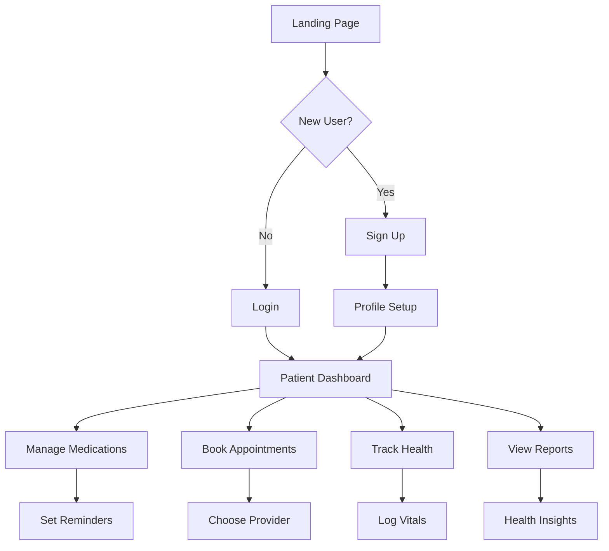
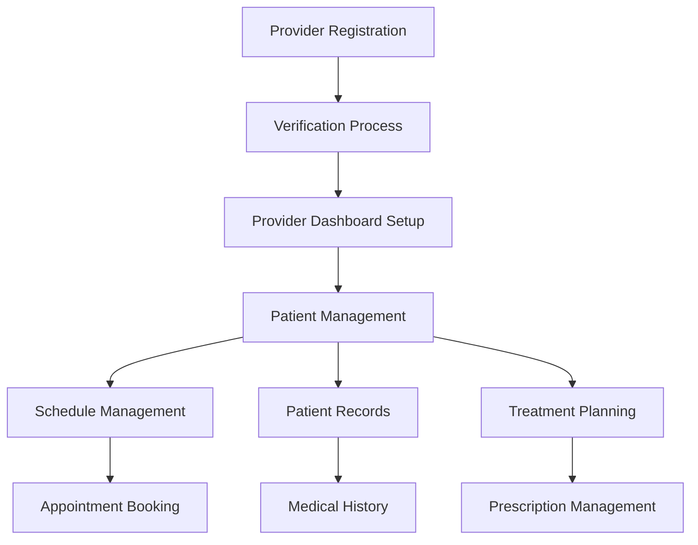

# Medicare+ 🏥
## Complete Healthcare Management Platform

### *Your Health, Our Priority - Simplified Healthcare Management for Everyone*

---

## 📋 Table of Contents
1. [Overview](#overview)
2. [Features](#features)
3. [User Journey & Flow](#user-journey--flow)
4. [Provider Flow](#provider-flow)
5. [Technical Architecture](#technical-architecture)
6. [Pitch Deck](#pitch-deck)
7. [Screenshots & UI](#screenshots--ui)
8. [Getting Started](#getting-started)

---

## 🌟 Overview

Medicare+ is a comprehensive digital healthcare management platform designed to bridge the gap between patients and healthcare providers. Our mission is to make healthcare accessible, organized, and efficient for everyone.

### **Vision**
To revolutionize healthcare management by providing an intuitive, secure, and comprehensive platform that empowers patients and healthcare providers alike.

### **Mission**
Simplify healthcare management through technology, ensuring better health outcomes and improved patient-provider communication.

---

## 🚀 Features

### **🔐 Authentication & Security**
- **Multi-Provider Authentication**: Google OAuth, Email/Password
- **Secure Profile Management**: Complete user profiles with privacy controls
- **Role-Based Access Control**: Separate patient and provider dashboards
- **Data Encryption**: All sensitive health data is encrypted and secure

### **👤 Patient Features**

#### **📊 Personal Health Dashboard**
- Real-time health metrics overview
- Personalized health insights and recommendations
- Quick access to all health-related information
- Mobile-responsive design for on-the-go access

#### **💊 Medication Management**
- Comprehensive medication tracking
- Smart medication reminders with customizable schedules
- Medication interaction warnings
- Prescription refill alerts
- Dosage tracking and adherence monitoring

#### **📅 Appointment System**
- Easy appointment booking with healthcare providers
- Automated appointment reminders
- Appointment history and tracking
- Rescheduling and cancellation options
- Integration with provider calendars

#### **📈 Health Monitoring**
- Vital signs tracking (blood pressure, heart rate, weight)
- Health trends and analytics
- Symptom logging and tracking
- Health goal setting and progress monitoring

#### **🔔 Smart Notifications**
- Medication reminders
- Appointment alerts
- Health tips and insights
- Emergency notifications
- Customizable notification preferences

#### **📱 Communication Tools**
- Secure messaging with healthcare providers
- Telemedicine integration
- Health record sharing
- Emergency contact management

### **🏥 Provider Features**

#### **📋 Provider Dashboard**
- Patient management system
- Appointment scheduling and management
- Patient health records access
- Treatment history tracking
- Analytics and reporting tools

#### **👥 Patient Management**
- Complete patient profiles
- Medical history access
- Treatment planning tools
- Prescription management
- Progress monitoring

#### **📊 Analytics & Insights**
- Patient health trends
- Treatment effectiveness tracking
- Appointment analytics
- Revenue and practice management
- Performance metrics

#### **🗓️ Schedule Management**
- Advanced appointment scheduling
- Calendar integration
- Availability management
- Automated scheduling
- Conflict resolution

---

## 🔄 User Journey & Flow

### **🆕 New User Onboarding**

1. **Landing Page** → User discovers Medicare+ features
2. **Sign Up** → Choose between Patient or Provider registration
3. **Authentication** → Google OAuth or Email/Password setup
4. **Profile Setup** → Complete essential information
5. **Dashboard Access** → Personalized dashboard based on role

### **👤 Patient User Flow**

### **🔄 Daily User Flow**

1. **Login** → Secure authentication
2. **Dashboard Overview** → Quick health status check
3. **Daily Tasks** → Medication reminders, appointments
4. **Health Tracking** → Log vitals, symptoms
5. **Communication** → Check messages from providers
6. **Planning** → Schedule future appointments, set health goals

### **📱 Mobile Experience**
- Fully responsive design
- Touch-optimized interface
- Offline capability for essential features
- Push notifications for reminders

---

## 🏥 Provider Flow

### **👨‍⚕️ Healthcare Provider Journey**

### **📋 Daily Provider Workflow**

1. **Dashboard Login** → Secure provider authentication
2. **Schedule Review** → Check daily appointments
3. **Patient Preparation** → Review patient files before appointments
4. **Consultation Management** → Document visit notes, update treatments
5. **Prescription Management** → Issue prescriptions, monitor adherence
6. **Follow-up Planning** → Schedule follow-ups, set reminders
7. **Analytics Review** → Track patient outcomes, practice performance

### **🔧 Provider Tools**

#### **Patient Management System**
- Complete patient database
- Medical history access
- Treatment timeline tracking
- Prescription history
- Communication logs

#### **Appointment Management**
- Real-time scheduling
- Automated reminders
- Cancellation management
- Virtual appointment options
- Resource allocation

#### **Clinical Tools**
- Electronic health records (EHR)
- Prescription management
- Lab result integration
- Treatment planning templates
- Progress monitoring tools

---

## 🏗️ Technical Architecture

### **Frontend Technologies**
- **HTML5/CSS3**: Modern web standards
- **JavaScript (ES6+)**: Interactive functionality
- **Responsive Design**: Mobile-first approach
- **Progressive Web App**: Offline capabilities

### **Backend & Database**
- **Supabase**: Real-time database and authentication
- **PostgreSQL**: Robust data storage
- **Row Level Security**: Data protection
- **RESTful APIs**: Scalable architecture

### **Security Features**
- **OAuth 2.0**: Secure authentication
- **Data Encryption**: End-to-end encryption
- **HIPAA Compliance**: Healthcare data protection
- **Role-Based Access**: Granular permissions

### **Deployment**
- **Netlify**: Fast, reliable hosting
- **CDN**: Global content delivery
- **SSL/TLS**: Secure connections
- **Auto-scaling**: Handle traffic spikes

---

## 🎯 Pitch Deck

### **🚨 The Problem**

**Healthcare Management is Broken**
- 📊 **70%** of patients struggle to manage medications effectively
- 🗓️ **30%** of appointments are missed due to poor scheduling
- 📋 **40%** of health records are incomplete or inaccessible
- 💸 **$100B+** wasted annually due to medication non-adherence

### **💡 Our Solution**

**Medicare+ - All-in-One Healthcare Management**
- 🎯 **Centralized Platform**: Everything in one place
- 📱 **Mobile-First**: Access anywhere, anytime
- 🤖 **Smart Reminders**: Never miss medications or appointments
- 🔐 **Secure & Private**: HIPAA-compliant data protection

### **📈 Market Opportunity**

- **🌍 Global Digital Health Market**: $659B by 2025
- **📱 mHealth Market**: $236B by 2026
- **👥 Target Audience**: 50M+ Americans with chronic conditions
- **💰 Revenue Potential**: $50-200 per user annually

### **🎯 Business Model**

1. **Freemium Model**: Basic features free, premium for advanced tools
2. **Provider Subscriptions**: $99-299/month for healthcare providers
3. **Integration Partnerships**: Revenue sharing with health systems
4. **Premium Services**: Telemedicine, advanced analytics

### **🏆 Competitive Advantages**

- **👨‍👩‍👧‍👦 User-Centric Design**: Built for real users, not tech
- **🔗 Dual Dashboard**: Serves both patients and providers
- **⚡ Real-Time Sync**: Instant updates and notifications
- **🛡️ Security First**: Enterprise-grade security standards

### **💰 Financial Projections**

| Year | Users | Revenue | Growth |
|------|-------|---------|--------|
| Year 1 | 10K | $500K | - |
| Year 2 | 50K | $2.5M | 400% |
| Year 3 | 200K | $10M | 300% |
| Year 4 | 500K | $25M | 150% |
| Year 5 | 1M+ | $50M+ | 100% |

---

## 🖼️ Screenshots & UI

### **🏠 Landing Page**
- Hero section with clear value proposition
- Feature highlights with visual icons
- Social proof and testimonials
- Clear call-to-action buttons

### **📱 Patient Dashboard**
- Clean, intuitive interface
- Health metrics at a glance
- Quick action buttons
- Personalized health insights

### **🏥 Provider Dashboard**
- Professional, clinical design
- Patient management tools
- Schedule overview
- Performance analytics

### **💊 Medication Management**
- Visual medication cards
- Reminder settings
- Interaction warnings
- Adherence tracking

### **📅 Appointment Booking**
- Calendar integration
- Provider availability
- Automated confirmations
- Rescheduling options

---

## 🚀 Getting Started

### **For Patients**

1. **Visit** [medicareplus.com](https://medicareplus.com)
2. **Sign Up** with email or Google account
3. **Complete** your health profile
4. **Start** managing your health journey

### **For Healthcare Providers**

1. **Request** provider access
2. **Complete** verification process
3. **Set up** your practice profile
4. **Begin** managing patients digitally

### **For Developers**

1. **Clone** the repository
2. **Install** dependencies: `npm install`
3. **Configure** environment variables
4. **Deploy** to Netlify or preferred platform

---

## 📞 Contact & Support

### **🛠️ Technical Support**
- 📧 **Email**: support@medicareplus.com
- 📱 **Phone**: 1-800-MEDICARE
- 💬 **Live Chat**: Available 24/7
- 📚 **Documentation**: [docs.medicareplus.com](https://docs.medicareplus.com)

### **🏢 Business Inquiries**
- 📧 **Partnerships**: partners@medicareplus.com
- 📧 **Sales**: sales@medicareplus.com
- 📧 **Media**: media@medicareplus.com

### **🏥 Healthcare Providers**
- 📧 **Provider Support**: providers@medicareplus.com
- 📞 **Provider Hotline**: 1-800-PROVIDER
- 🎓 **Training**: training@medicareplus.com

---

## 🏷️ Tags

`#Healthcare` `#DigitalHealth` `#HealthTech` `#MedTech` `#PatientCare` `#HealthcareIT` `#Telemedicine` `#HealthManagement` `#MedicalSoftware` `#HealthPlatform`

---

**© 2024 Medicare+. All rights reserved.**

*Making healthcare accessible, one click at a time.* 🏥✨ 